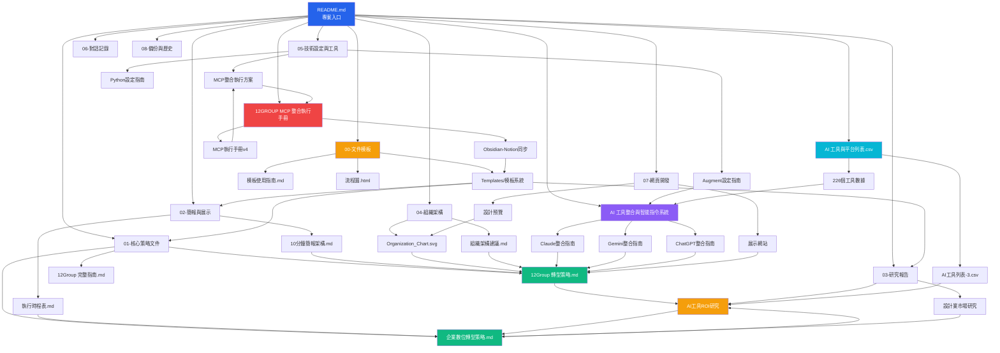

# 🧭 12Group 專案導覽系統 | Project Navigation System

## 🎯 核心原則 | Core Principles

### 📚 Obsidian 主資料庫優先 | Obsidian Database Priority
```
🔄 工作流程優先順序：
1. 📝 Obsidian 本地資料庫 (主要工作環境)
2. 🔗 檔案連結與元數據完整性
3. 📤 Notion 同步 (次要分享平台)
4. 🌐 網頁展示 (對外展示)
```

### 🛡️ 資料完整性保護 | Data Integrity Protection
- **主要工作環境**: Obsidian 本地資料庫
- **檔案結構**: 嚴格遵循 `.clinerules/12.md` 命名規範
- **模板系統**: 使用 `00-文件模板/` 中的 Templater 模板
- **同步機制**: 透過 `upload-to-notion.js` 單向同步至 Notion

## 🚀 新手入門 | Getting Started

### 📋 必讀檔案順序 | Essential Reading Order
```
1. 📖 README.md → 專案概述與目標
2. 🧭 00-12Group 專案導覽系統 Project Navigation System.md (本檔案) → 導覽系統
3. 📝 .clinerules/12.md → 檔案命名規範
4. 📋 00-文件模板/模板使用指南.md → 模板使用方法
5. 🎯 01-核心策略文件/12Group 轉型策略 - Claude_250620.md → 核心策略
```

### ⚡ 快速存取 | Quick Access
| 需求           | 檔案路徑                                                     | 用途                    | 狀態     |
| -------------- | ------------------------------------------------------------ | ----------------------- | -------- |
| 📈 **ROI 數據** | `03-研究報告/AI工具投資ROI深度驗證研究報告/`                 | 投資回報分析            | ✅ 已驗證 |
| 🎯 **策略規劃** | `01-核心策略文件/12Group 轉型策略 - Claude_250620.md`        | AI 轉型策略             | ✅ 最終版 |
| 📅 **執行時程** | `02-簡報與展示/12Group_AI轉型執行時程表與行動方案_深化版.md` | 實施計劃                | ✅ 深化版 |
| 🏢 **組織架構** | `04-組織架構/Organization_Chart.svg`                         | 組織結構圖              | ✅ 已完成 |
| 🌐 **網站展示** | `07-網頁開發/index-cline/index-cline.html`                   | 策略展示網站            | ✅ 可用   |
| 📝 **模板系統** | `00-文件模板/Templates/`                                     | 文件模板與指南          | ✅ 已建立 |
| 🤖 **AI工具整合** | `AI 工具整合與智能指令系統 Personalized AI Tools Integration & Intelligent - 250628/` | AI工具整合指南 | ✅ 完整版 |
| 🔧 **MCP整合** | `12GROUP MCP 整合執行手冊/`                                  | MCP系統整合方案         | ✅ 交付版 |
| 📊 **CSV數據** | `AI 工具與平台列表-3.csv`                                   | 226個AI工具完整清單     | ✅ 最新版 |

## 🗺️ 檔案關聯圖 | File Relationship Map



## 📅 專案時程表 | Project Timeline

### 🎯 轉型三階段規劃 | Three-Phase Transformation Plan

#### 第一階段：基礎建設 (0-6個月)
```
📋 主要任務：
├── AI 工具導入 (Figma, ChatGPT, Claude)
├── 團隊培訓計劃
├── 基礎流程建立
└── 效果監控機制

📊 關鍵指標：
├── 工具採用率 > 80%
├── 培訓完成率 > 95%
└── 初期 ROI > 200%

📄 相關文件：
├── 02-簡報與展示/執行時程表.md
└── 05-技術設定與工具/
```

#### 第二階段：流程優化 (6-18個月)
```
📋 主要任務：
├── 工作流程優化
├── 跨部門協作強化
├── 進階功能應用
└── 績效評估調整

📊 關鍵指標：
├── 效率提升 > 40%
├── 協作滿意度 > 85%
└── 累積 ROI > 500%

📄 相關文件：
├── 04-組織架構/組織架構建議.md
└── 03-研究報告/真實數據.md
```

#### 第三階段：全面轉型 (18-36個月)
```
📋 主要任務：
├── 創新應用開發
├── 市場競爭優勢建立
├── 持續改進機制
└── 經驗複製推廣

📊 關鍵指標：
├── 市場領先地位
├── 創新項目 > 5個
└── 總體 ROI > 1000%

📄 相關文件：
├── 01-核心策略文件/未來願景策略.md
└── 06-對話記錄/ (AI 策略建議)
```

## 🎯 角色導向導覽 | Role-based Navigation

### 👔 高階主管 (CEO/COO)
```
🎯 關注重點：策略價值、ROI、風險控制
📋 建議路徑：
1. README.md (專案概述)
2. 02-簡報與展示/10分鐘簡報架構：12Group轉型與設計創新策略.md (核心策略)
3. 03-研究報告/AI工具投資ROI深度驗證研究報告/ (投資效益)
4. 01-核心策略文件/12Group 轉型策略 - Claude_250620.md (完整計劃)
5. 07-網頁開發/index-cline/ (視覺化展示)

🔧 相關工具：
- 使用 04-ROI計算模板.md 進行投資分析
- 透過 upload-to-notion.js 分享至 Notion
```

### 🎨 設計總監 (CD)
```
🎯 關注重點：設計工具、創新流程、團隊效率
📋 建議路徑：
1. 03-研究報告/設計業AI工具研究.md (產業分析)
2. 01-核心策略文件/AI_Transformation_Strategy.md (AI 策略)
3. 00-文件模板/模板使用指南.md (工作流程)
4. 07-網頁開發/index-cline/ (展示網站)
5. 05-技術設定與工具/ (工具設定)

🔧 相關工具：
- 使用 02-研究筆記模板.md 記錄設計研究
- 使用 03-策略分析模板.md 制定設計策略
```

### 💻 技術團隊 (CTO/開發者)
```
🎯 關注重點：技術實現、系統整合、工具配置
📋 建議路徑：
1. .clinerules/12.md (檔案命名規範)
2. 12GROUP MCP 整合執行手冊/ (MCP整合)
3. 05-技術設定與工具/Augment_MCP_Setup_Guide.md (設定指南)
4. 07-網頁開發/ (前端開發)
5. 05-技術設定與工具/upload-to-notion.js (自動化腳本)

🔧 相關工具：
- 維護 Obsidian Templater 模板系統
- 管理 Notion 同步機制
```

### 👥 專案經理 (PM)
```
🎯 關注重點：執行計劃、進度追蹤、資源協調
📋 建議路徑：
1. 00-12Group 專案導覽系統 Project Navigation System.md (本檔案，專案導覽)
2. 00-文件模板/模板使用指南.md (標準化流程)
3. 02-簡報與展示/12Group_AI轉型執行時程表與行動方案_深化版.md (時程規劃)
4. 04-組織架構/organization_matrix_table.md (責任分工)
5. 08-備份與歷史/Tasks_2025-06-20T23-18-37.md (歷史進度)

🔧 相關工具：
- 使用 01-專案主控模板.md 管理專案
- 使用 05-會議記錄模板.md 記錄會議
- 透過 Notion Database 追蹤進度
```

## 🔍 主題導向搜尋 | Topic-based Search

### 💰 ROI 與投資效益
```
📊 相關檔案：
├── 03-研究報告/AI工具投資ROI深度驗證研究報告/
├── 03-研究報告/真實數據.md
├── 02-簡報與展示/10分鐘簡報架構.md
└── 07-網頁開發/index-cline/ (視覺化展示)
```

### 🤖 AI 工具與技術
```
🔧 相關檔案：
├── 01-核心策略文件/AI_Transformation_Strategy.md
├── 05-技術設定與工具/Figma_MCP_Services_Comparison.md
├── 06-對話記錄/ (AI 專家建議)
└── 03-研究報告/設計業AI工具研究.md
```

### 🏢 組織與管理
```
👥 相關檔案：
├── 04-組織架構/ (完整組織設計)
├── 01-核心策略文件/完整指南.md
├── 02-簡報與展示/執行時程表.md
└── 06-對話記錄/ (管理建議)
```

### 🎨 設計與創新
```
✨ 相關檔案：
├── 07-網頁開發/ (設計展示)
├── 03-研究報告/設計業市場研究.md
├── 01-核心策略文件/設計創新策略.md
└── 04-組織架構/設計部門規劃.md
```

## 🛠️ 維護與更新指南 | Maintenance & Update Guide

### 🔄 Obsidian 優先工作流程 | Obsidian-First Workflow

#### 1. 檔案建立與編輯 | File Creation & Editing
```
🎯 標準流程：
1. 📝 在 Obsidian 中使用 Templater 模板建立新檔案
2. 🔗 確保檔案連結和標籤正確設定
3. 📋 遵循 .clinerules/12.md 命名規範
4. ✅ 在 Obsidian 中完成內容編輯和校對
5. 📤 使用 upload-to-notion.js 同步至 Notion (可選)
```

#### 2. 檔案更新流程 | File Update Process
```
🔄 更新順序：
1. **Obsidian 本地修改** → 確保主資料庫完整性
2. **檔案連結檢查** → 驗證內部連結有效性
3. **元數據更新** → 更新標籤、分類、日期
4. **索引檔案更新** → 更新對應 INDEX.md
5. **Notion 同步** → 僅在需要分享時執行
6. **備份歸檔** → 重要變更備份到 08-備份與歷史/
```

#### 3. 模板系統維護 | Template System Maintenance
```
📝 模板更新流程：
1. **模板修改** → 在 00-文件模板/ 中更新
2. **測試驗證** → 建立測試檔案驗證功能
3. **指南更新** → 更新模板使用指南.md
4. **團隊通知** → 通知團隊成員新版本
```

### 🔍 品質控制檢查清單 | Quality Control Checklist

#### 新檔案檢查 | New File Checklist
- [ ] 使用正確的 Templater 模板
- [ ] 檔案名稱符合 `.clinerules/12.md` 規範
- [ ] 內部連結格式正確 `[[檔案名稱]]`
- [ ] 標籤和分類設定完整
- [ ] 內容結構符合模板要求
- [ ] 在 Obsidian 中預覽正常

#### 定期維護 | Regular Maintenance
- **每週**:
  - 檢查 Obsidian 連結有效性
  - 驗證新增檔案的命名規範
  - 測試 Templater 模板功能
- **每月**:
  - 更新 PROJECT_NAVIGATION.md
  - 檢視 Notion 同步狀況
  - 備份重要檔案變更
- **每季**:
  - 檢視整體檔案結構
  - 優化模板系統
  - 評估工作流程效率
- **每年**:
  - 全面檢討命名規範
  - 更新技術工具配置
  - 制定新年度標準

### ⚠️ 重要注意事項 | Important Notes

#### 🚫 避免的操作 | Operations to Avoid
- **直接在 Notion 中編輯內容** → 可能導致資料不同步
- **繞過 Templater 模板** → 破壞檔案結構一致性
- **忽略命名規範** → 影響檔案組織和搜尋
- **刪除 Obsidian 連結** → 破壞知識圖譜結構

#### ✅ 推薦的操作 | Recommended Operations
- **優先使用 Obsidian** → 保持主資料庫完整性
- **遵循模板系統** → 確保檔案結構一致
- **定期備份** → 保護重要資料
- **測試後同步** → 確保 Notion 同步品質

---

**導覽系統維護**: Christian Wu
**最後更新**: 2025-06-23
**版本**: v2.0 (加入 Obsidian 優先原則)
**狀態**: 已更新完成 - 強化 Obsidian 主資料庫保護
