# Claude + Gemini 智能房源分析平台 - 統整版 APP Blueprint

**創建日期**: 2025-07-13  
**最後更新**: 2025-07-13  
**版本**: v2.0  
**來源**: 基於 Rental-Claude.md 對話記錄統整

---

## 🎯 系統概述

### 核心理念
- **AI 驅動**: Claude 負責智能分析，Gemini Pro 2.5 負責視覺識別與批量搜索
- **多元輸入**: 支援 URL、截圖、智能搜索三種輸入方式
- **手機優先**: 100% 手機優化的響應式設計
- **無需複雜基礎設施**: 免 MCP、免 Notion，使用瀏覽器本地存儲
- **30 分鐘部署**: Replit 一鍵部署，即開即用

### 目標用戶
- **租屋族**: 需要快速篩選和分析房源
- **房產仲介**: 需要批量處理和對比房源
- **投資者**: 需要數據化分析房源價值

## 🗂️ 完整資料庫結構（依使用者優先順序排列）

### 高優先級欄位（使用者最關心）
1. **房源名稱** (title) - rich_text
2. **租金** (rent) - number
3. **平均評分** (average_score) - number
4. **適合度** (suitability) - rich_text
5. **地址** (address) - rich_text
6. **區域名稱** (area_name) - rich_text
7. **房型配置** (room_layout) - rich_text（幾房幾廳幾衛浴）
8. **坪數/室內面積** (floor_area) - number
9. **看房狀態** (viewing_status) - select

### 中優先級欄位（重要參考資訊）
10. **設備與特色** (equipment_features) - multi_select
11. **寵物政策** (pet_policy) - select
12. **交通便利性** (transportation) - rich_text
13. **最近捷運站** (nearest_mrt) - rich_text
14. **入住日期** (available_date) - date
15. **樓層資訊** (floor_info) - rich_text
16. **朝向** (orientation) - select
17. **屋齡** (building_age) - number

### 低優先級欄位（詳細資訊）
18. **公共設施及空間** (public_facilities) - multi_select
19. **生活機能** (living_convenience) - rich_text
20. **水電費** (utilities) - rich_text
21. **押金（個月）** (deposit_months) - number
22. **管理費** (management_fee) - number
23. **最短租期** (minimum_lease) - select
24. **性別限制** (gender_restriction) - select
25. **身份限制** (identity_restriction) - multi_select
26. **停車費** (parking_fee) - number
27. **重要優勢** (key_advantages) - rich_text
28. **房東聯繫方式** (landlord_contact) - rich_text
29. **網頁連結** (web_link) - url
30. **Google Map地圖** (google_map_url) - url
31. **備註** (notes) - rich_text
32. **簽約注意事項** (contract_notes) - rich_text
33. **照片** (photos) - files
34. **更新日期** (update_date) - date
35. **其餘房源備註** (additional_notes) - rich_text

## 🏗️ 技術架構

### 前端架構
```
前端層 (React + Tailwind + Alpine.js)
├── 輸入處理模組
│   ├── URL 解析器 (支援多租屋網站)
│   ├── 圖片上傳器 (拖拽 + 相機)
│   └── 智能搜索器 (條件篩選)
├── AI 整合模組
│   ├── Claude API 客戶端
│   ├── Gemini Pro 2.5 客戶端
│   └── 結果合併處理器
├── 資料展示模組
│   ├── 房源卡片組件
│   ├── 對比分析表格
│   └── 統計圖表組件
└── 本地存儲模組
    ├── IndexedDB 管理器
    ├── 資料匯出功能
    └── 雲端同步接口
```

### 後端架構
```
後端層 (Node.js + Express)
├── API 路由層
│   ├── /api/analyze-url
│   ├── /api/analyze-image
│   ├── /api/batch-search
│   └── /api/export-data
├── AI 服務層
│   ├── Claude 整合服務
│   ├── Gemini Pro 2.5 服務
│   └── 結果處理服務
├── 爬蟲服務層
│   ├── 591 專用爬蟲
│   ├── 通用房源爬蟲
│   └── 反檢測機制
└── 工具服務層
    ├── 圖片處理工具
    ├── 資料驗證工具
    └── 錯誤處理工具
```

## 📱 使用者介面設計

### 主畫面佈局
```
┌─────────────────────────────────┐
│ 🏠 智能房源分析 [📊] [⬇️] [⚙️]     │ ← 頂部導航
├─────────────────────────────────┤
│ 📈 [總數:15] [高分:8] [收藏:3]     │ ← 統計卡片
├─────────────────────────────────┤
│ 🔗 URL | 📷 圖片 | 🔍 搜索        │ ← 輸入方式選擇
├─────────────────────────────────┤
│ [輸入區域 - 動態切換]              │ ← 輸入介面
├─────────────────────────────────┤
│ 🔍 [搜索] [評分▼] [排序▼]         │ ← 篩選器
├─────────────────────────────────┤
│ ┌─────────────────────────────┐ │
│ │ 📷    │ 💰 $18,000  ⭐ 92   │ │ ← 房源卡片
│ │ 圖片   │ 📍 大安區         │ │
│ │      │ 🏷️ 非常適合       │ │
│ │ [❤️] [👁️] [🔗] [📋]        │ │
│ └─────────────────────────────┘ │
└─────────────────────────────────┘
```

### Dashboard 視覺化設計

#### Smart Analytics Dashboard
```
┌─────────────────────────────────────────────────────┐
│ 📊 市場洞察儀表板                                      │
├─────────────────────────────────────────────────────┤
│ ┌──────────┐ ┌──────────┐ ┌──────────┐ ┌──────────┐ │
│ │ 總房源數  │ │ 平均評分  │ │ 高分房源  │ │ 收藏數量  │ │
│ │   156    │ │   78.2   │ │    23    │ │    8     │ │
│ │  ↑ 12%   │ │  ↑ 3.1   │ │  ↑ 18%   │ │  ↑ 2     │ │
│ └──────────┘ └──────────┘ └──────────┘ └──────────┘ │
├─────────────────────────────────────────────────────┤
│ ┌─────────────────┐ ┌─────────────────────────────┐ │
│ │ 📈 價格分布圖    │ │ 🎯 AI 市場洞察              │ │
│ │                │ │                             │ │
│ │ [價格分布圖表]   │ │ • 大安區房價呈上漲趨勢       │ │
│ │                │ │ • 寵物友善房源供應緊缺       │ │
│ │                │ │ • 建議關注信義區新房源       │ │
│ └─────────────────┘ └─────────────────────────────┘ │
├─────────────────────────────────────────────────────┤
│ ┌─────────────────┐ ┌─────────────────────────────┐ │
│ │ 🗺️ 區域熱力圖    │ │ ⚡ 智能推薦                 │ │
│ │                │ │                             │ │
│ │ [互動地圖]       │ │ 基於您的偏好，推薦以下房源：  │ │
│ │                │ │ 1. 中山區精緻套房 (89分)     │ │
│ │                │ │ 2. 大安區寵物友善 (87分)     │ │
│ └─────────────────┘ └─────────────────────────────┘ │
└─────────────────────────────────────────────────────┘
```

### 多元呈現方式設計

#### 檢視模式切換器
```
┌─────────────────────────────────────────┐
│ 🔍 [搜索框] [篩選▼] [排序▼] │ ≡ □□ ▬ │ ← 檢視模式
└─────────────────────────────────────────┘
```

#### 1. 條列式檢視
```
┌────────────────────────────────────────────────────┐
│ [圖] 中壢南亞技術學院旁大套房    $8,500  ⭐ 78分   │
│ [片] 📍 中壢區中山東路三段      🏠 獨立套房 10坪    │
│     🎯 近商圈 免管理費          [❤️][👁️][🔗]      │
├────────────────────────────────────────────────────┤
│ [圖] 大安區精緻套房            $18,000  ⭐ 92分   │
│ [片] 📍 大安區敦化南路          🏠 1房1廳 25坪     │
│     🐱 寵物友善 變頻冷氣        [❤️][👁️][🔗]      │
└────────────────────────────────────────────────────┘
```

#### 2. 兩欄卡片檢視
```
┌─────────────────────┐ ┌─────────────────────┐
│ [房源圖片]           │ │ [房源圖片]           │
│                    │ │                    │
│ 中壢南亞技術學院旁   │ │ 大安區精緻套房      │
│ $8,500  ⭐ 78分     │ │ $18,000  ⭐ 92分    │
│ 📍 中壢區           │ │ 📍 大安區           │
│ 🏠 獨立套房 10坪    │ │ 🏠 1房1廳 25坪     │
│ [❤️] [👁️] [🔗] [📋] │ │ [❤️] [👁️] [🔗] [📋] │
└─────────────────────┘ └─────────────────────┘
```

#### 3. 全寬橫條卡片檢視
```
┌──────────────────────────────────────────────────────────────┐
│ [大圖片] │ 中壢南亞技術學院旁大套房              $8,500  ⭐ 78分 │
│        │ 📍 中壢區中山東路三段                              │
│ [180px] │ 🏠 獨立套房 • 10坪 • 1F/3F                       │
│        │ 🎯 近商圈 • 免管理費 • 隨時可遷入                  │
│        │ [❤️收藏] [👁️查看] [🔗原網頁] [🔍找相似] [📋狀態]    │
└──────────────────────────────────────────────────────────────┘
```

### 智能相似房源推薦系統

#### Hover 互動設計
```
房源卡片 (Hover 狀態)
┌─────────────────────────────────────────┐
│ [房源圖片]     💰 $18,000  ⭐ 92分      │
│              📍 大安區敦化南路          │
│              🏠 1房1廳 25坪            │
│ ┌─────────────────────────────────────┐ │
│ │ 🔍 相似房源推薦 (AI 搜尋)            │ │
│ │ ┌─────┐ ┌─────┐ ┌─────┐             │ │
│ │ │房源A│ │房源B│ │房源C│             │ │
│ │ │89分 │ │85分 │ │82分 │             │ │
│ │ └─────┘ └─────┘ └─────┘             │ │
│ │ [查看全部相似房源]                   │ │
│ └─────────────────────────────────────┘ │
│ [❤️] [👁️] [🔗] [📋] [🔍找相似]        │
└─────────────────────────────────────────┘
```

### 排序功能

#### 支援排序方式
- **租金排序**: 低到高 / 高到低
- **坪數排序**: 小到大 / 大到小  
- **平均評分**: 高到低 / 低到高
- **更新時間**: 最新 / 最舊
- **適合度**: 最適合 / 可考慮
- **區域**: A-Z / Z-A

## 🤖 多層級 AI 協作架構

### 擴展AI工具生態系統

#### Tier 1: 戰略規劃與文檔架構層
- **Manus**: PRD與Blueprint結構化整理（300點/天限制）
- **Claude**: 深度分析與決策支援
- **協作模式**: 分析-整理閉環

#### Tier 2: 設計原型與視覺開發層
- **MagicPath.ai**: 高品質頁面框架設計（5個/天免費額度）
- **UXPilot.ai**: 多頁面複雜介面設計（支援Context層次管理）
- **Framer**: 元件庫建立與迭代（Template + AI Workshop）
- **Lovable.dev**: 設計導向快速原型

#### Tier 3: 技術實現與程式碼生成層
- **Bolt.new**: 全端應用快速生成
- **v0.dev**: React + Tailwind組件精確實現
- **Tempo.new**: 互動元件特化開發
- **Cline**: 程式碼優化與效能提升
- **Gemini CLI**: 快速迭代與測試

### AI 協作工作流程

```mermaid
gantt
    title AI 協作時程表
    dateFormat s
    axisFormat %s
    
    section 並行階段
    Gemini CLI - 圖片識別    :0, 10
    Cline - 系統初始化      :0, 15
    Claude - 基礎分析       :0, 20
    
    section 依序階段
    Augment - 深度整合      :20, 40
    Claude - 深度分析       :25, 35
    Cline - 執行優化        :35, 45
    
    section 整合階段
    所有AI - 結果驗證       :45, 50
```


## 💾 本地存儲系統設計

### IndexedDB 架構
```javascript
class LocalStorageManager {
  constructor() {
    this.dbName = 'RentalAnalyzer';
    this.version = 2;
    this.schemas = {
      properties: 'id, title, price, score, suitability, area, address, favorite, createdAt',
      searches: 'id, query, filters, results, timestamp',
      comparisons: 'id, propertyIds, notes, createdAt',
      settings: 'key, value'
    };
  }

  // 建立房源表
  async saveProperty(propertyData) {
    const property = {
      ...propertyData,
      id: propertyData.id || Date.now() + Math.random(),
      createdAt: new Date(),
      updatedAt: new Date(),
      favorite: false
    };
    
    return store.put(property);
  }

  // 資料匯出功能
  async exportToJSON() {
    const exportData = {
      exportDate: new Date(),
      version: '2.0',
      data: {
        properties: await this.getAllProperties(),
        searches: await this.getAllSearches(),
        stats: await this.getStats()
      }
    };
    
    const blob = new Blob([JSON.stringify(exportData, null, 2)], {
      type: 'application/json'
    });
    
    const url = URL.createObjectURL(blob);
    const a = document.createElement('a');
    a.href = url;
    a.download = `rental-analysis-${new Date().toISOString().split('T')[0]}.json`;
    a.click();
    
    URL.revokeObjectURL(url);
  }
}
```

## 🚀 部署架構

### Replit 部署配置
```json
{
  "name": "rental-analyzer-app",
  "version": "2.0.0",
  "description": "Claude + Gemini powered rental property analyzer",
  "main": "server/index.js",
  "scripts": {
    "start": "node server/index.js",
    "dev": "nodemon server/index.js",
    "build": "npm run build:css",
    "build:css": "tailwindcss -i src/styles/input.css -o public/styles/output.css --minify",
    "test": "jest",
    "deploy": "replit deploy"
  },
  "dependencies": {
    "express": "^4.18.2",
    "cors": "^2.8.5",
    "multer": "^1.4.5",
    "sharp": "^0.32.6",
    "axios": "^1.6.0",
    "cheerio": "^1.0.0-rc.12",
    "puppeteer": "^21.5.2",
    "winston": "^3.11.0",
    "helmet": "^7.1.0",
    "rate-limiter-flexible": "^3.0.8"
  },
  "engines": {
    "node": ">=18.0.0"
  }
}
```

### 環境變數配置
```env
# API Keys
CLAUDE_API_KEY=your_claude_api_key
GEMINI_API_KEY=your_gemini_api_key

# Server Configuration
PORT=3000
NODE_ENV=production

# Security
JWT_SECRET=your_jwt_secret
RATE_LIMIT_MAX=100
RATE_LIMIT_WINDOW=900000

# Optional Cloud Sync
FIREBASE_CONFIG={}
SUPABASE_URL=your_supabase_url
SUPABASE_ANON_KEY=your_supabase_anon_key
```

## 🎯 實施路徑與里程碑

### Phase 1: 核心基礎建設（週1-2）
- [ ] 基礎架構搭建（React + Node.js）
- [ ] AI API 整合（Claude + Gemini）
- [ ] 基本 UI 框架建立
- [ ] 本地存儲系統實現

### Phase 2: 核心功能開發（週3-4）
- [ ] URL 房源分析功能
- [ ] 圖片識別功能
- [ ] 智能搜索功能
- [ ] 房源卡片組件開發

### Phase 3: 進階功能開發（週5-6）
- [ ] Dashboard 視覺化
- [ ] 相似房源推薦
- [ ] 多種檢視模式
- [ ] 排序與篩選功能

### Phase 4: 優化與部署（週7-8）
- [ ] 效能優化
- [ ] 使用者體驗改善
- [ ] 錯誤處理完善
- [ ] Replit 部署與測試

## 📊 評分系統設計

### 評分標準（總分100分）
- **價格評分** (30分): 預算符合度
- **必要設備** (40分): 變頻冷氣、冰箱、對外窗、洗衣機
- **寵物友善** (20分): 允許養寵物
- **地點評分** (10分): 捷運距離、偏好地區
- **排除條件** (-50分): 無對外窗、壁癌等

### 推薦等級
- 85-100分: 極力推薦 🌟
- 75-84分: 推薦 👍  
- 65-74分: 可考慮 👌
- 55-64分: 普通 🤔
- <55分: 不推薦 ❌

## 🔒 安全性與效能考量

### 安全性措施
- API 金鑰安全儲存
- 請求速率限制
- 資料驗證與清理
- HTTPS 強制使用

### 效能最佳化
- 圖片懶載入
- API 請求快取
- 資料庫索引優化
- CDN 靜態資源

### 反爬蟲策略
- 隨機 User-Agent 輪換
- 隨機延遲（2-5秒）
- 請求間隔控制
- 錯誤重試機制

## 🎨 設計系統規範

### 色彩系統
```css
:root {
  --color-primary: #3B82F6;
  --color-secondary: #10B981;
  --color-accent: #F59E0B;
  --color-neutral-50: #F9FAFB;
  --color-neutral-900: #111827;
}
```

### 字體系統
```css
.text-heading-lg { font-size: 32px; line-height: 40px; font-weight: bold; }
.text-heading-md { font-size: 24px; line-height: 32px; font-weight: 600; }
.text-body-lg { font-size: 16px; line-height: 24px; font-weight: 400; }
.text-body-sm { font-size: 14px; line-height: 20px; font-weight: 400; }
```

### 間距系統
```css
.spacing-xs { gap: 4px; }
.spacing-sm { gap: 8px; }
.spacing-md { gap: 16px; }
.spacing-lg { gap: 24px; }
.spacing-xl { gap: 32px; }
```

---

## 📝 結論

這個統整版 APP Blueprint 整合了從 Rental-Claude.md 對話記錄中提取的最完整和最新的需求與功能設計。該平台結合了多層級 AI 協作、現代化 UI/UX 設計、完整的資料庫結構，以及實用的部署策略，為租屋市場提供了一個智能化、高效率的分析解決方案。

**核心優勢**:
1. **完整的35個資料庫欄位**，依使用者優先順序排列
2. **多層級AI協作架構**，整合了9種專業AI工具
3. **三種靈活的檢視模式**，適應不同使用場景
4. **智能相似房源推薦**，基於AI外網搜索
5. **本地存儲 + 雲端同步**，資料安全可靠
6. **30分鐘快速部署**，Replit一鍵啟動

這個 Blueprint 已經準備好進入開發階段，可作為完整的技術規格書和產品需求文檔使用。